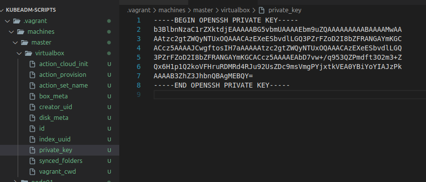

# Configuração do Ambiente Distribuído das VMS com Vagrant e Kubernetes

Devido à falta de integração presencial entre os integrantes do grupo, optamos pelo uso de máquinas virtuais (VMs) para simular um ambiente distribuído, no qual o Kubernetes seria configurado.

## 1. Primeira Tentativa: Ubuntu Live Server + virsh

Inicialmente, utilizamos a distribuição **Ubuntu Live Server** em conjunto com o **virsh** e o **virt-partitioner** para criar as VMs. Foram alocados:

- **VM principal (master):** 6 GB de RAM e 30 GB de disco
- **VMs secundárias (workers):** 3 GB de RAM e 20 GB de disco cada

Devido a erros recorrentes na configuração do Kubernetes com essa abordagem, decidimos migrar para uma solução baseada no **Vagrant**.

---

## 2. Migração para Vagrant

**Vagrant** é uma ferramenta para construir e gerenciar ambientes virtuais de forma simples e reprodutível, utilizando arquivos de configuração (`Vagrantfile`) para automatizar o provisionamento de VMs.

No novo cenário, utilizamos o seguinte arquivo `Vagrantfile` para criar e configurar três VMs (uma master e duas workers):

```ruby
Vagrant.configure("2") do |config|
  config.vm.provision "shell", inline: <<-SHELL
    apt-get update -y
    echo "192.168.56.10  master-node" >> /etc/hosts
    echo "192.168.56.11  worker-node01" >> /etc/hosts
    echo "192.168.56.12  worker-node02" >> /etc/hosts
  SHELL

  config.vm.define "master" do |master|
    master.vm.box = "ubuntu/jammy64"
    master.vm.hostname = "master-node"
    master.vm.network "private_network", ip: "192.168.56.10"
    master.vm.network "forwarded_port", guest: 30031, host: 30031
    master.vm.provider "virtualbox" do |vb|
      vb.memory = 4048
      vb.cpus = 2
    end
  end

  (1..2).each do |i|
    config.vm.network "forwarded_port", guest: 30031, host: 30031 + i, auto_correct: true
    config.vm.define "node0#{i}" do |node|
      node.vm.box = "bento/ubuntu-22.04"
      node.vm.hostname = "worker-node0#{i}"
      node.vm.network "private_network", ip: "192.168.56.1#{i}"
      node.vm.provider "virtualbox" do |vb|
        vb.memory = 2048
        vb.cpus = 1
      end
    end
  end
end
```

## 3. Alocação de Recursos

Master node: 4 GB de RAM, 2 vCPUs, 30 GB de disco

Worker nodes: 2 GB de RAM, 1 vCPU, 20 GB de disco cada

## 4. Espelhamento de Portas

Para facilitar o acesso externo aos serviços rodando dentro dos pods do Kubernetes (por exemplo, o server_socket), configuramos o espelhamento de portas (“port forwarding”) no Vagrant.
Assim, acessos à porta 30031 do host são redirecionados para a porta 30031 da VM correspondente, permitindo testes e comunicação entre diferentes componentes do sistema, inclusive a partir do host principal.

## 5. Conexão ssh com as VMs

Após a criação das VMs pelo Vagrant, é possível realizar conexão SSH para configuração do ambiente e criação dos arquivos YAML utilizados na orquestração dos containers, pods e na configuração de escalabilidade horizontal no Kubernetes.

O Vagrant facilita o acesso SSH às máquinas virtuais provisionadas, pois gera automaticamente as chaves de acesso e gerencia a comunicação entre o host e as VMs.

As chaves SSH são armazenadas dentro da pasta oculta .vagrant, que é criada na raiz do projeto durante a execução do vagrant up. Cada subpasta dentro de .vagrant/machines/ corresponde a uma das VMs criadas (por exemplo: master, node01, node02), armazenando os arquivos necessários para gerenciamento e acesso de cada VM.

> Obs.: Não é necessário copiar ou mover as chaves manualmente. O comando `vagrant ssh <nome-da-vm>` já utiliza automaticamente as chaves corretas, permitindo uma conexão direta e segura do host para a VM.



