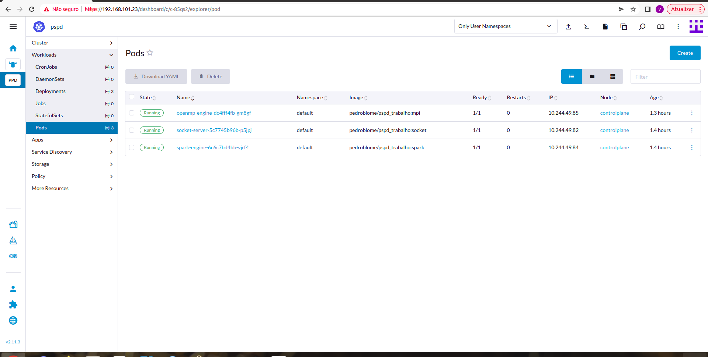
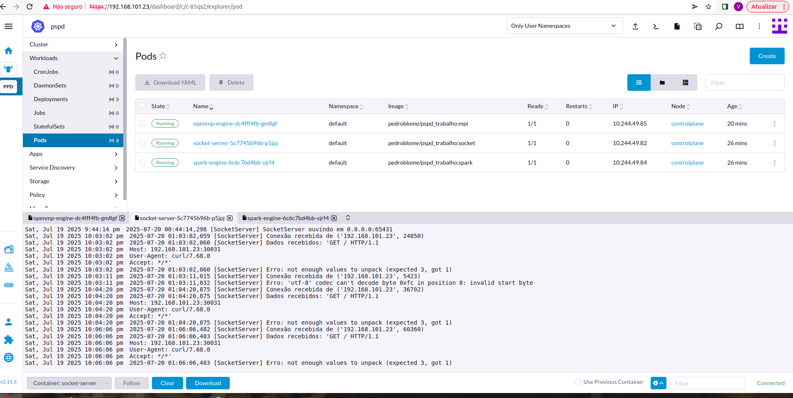

# Jogo da vida - Aplicando sistemas distribuidos e escaláveis

## Cluster Kubernetes no Rancher

Representação do jogo do vida com resolução openmp/mpi + spark com aplicação containerizada e orquestração com kubernetes.

## Pods Criados

## Logs

